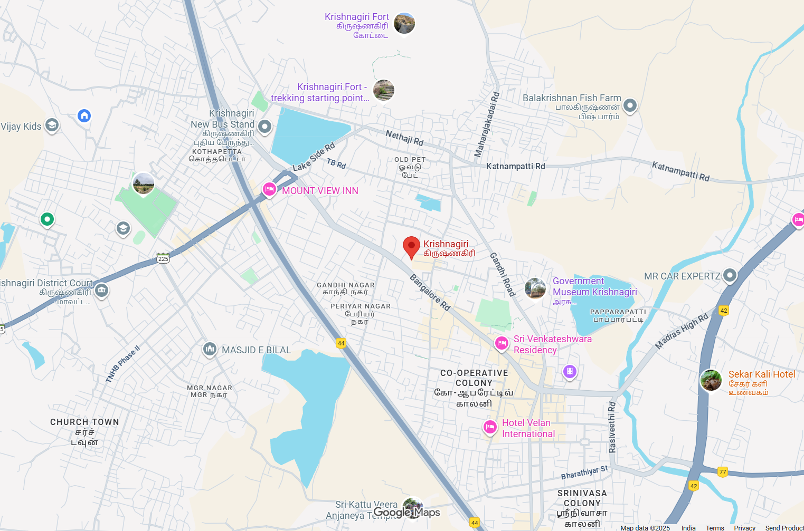
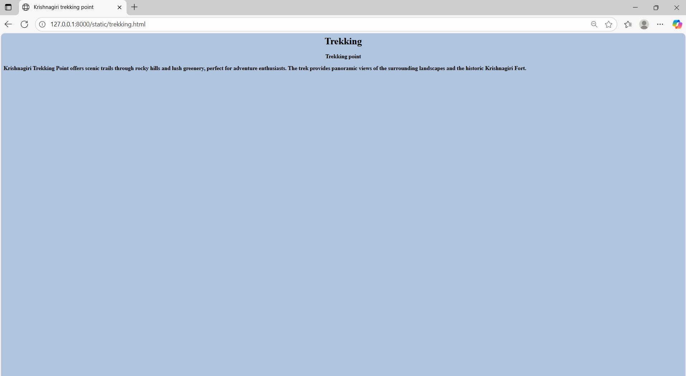

# Ex04 Places Around Me
## Date: 30-10-25

## AIM
To develop a website to display details about the places around my house.

## DESIGN STEPS

### STEP 1
Create a Django admin interface.

### STEP 2
Download your city map from Google.

### STEP 3
Using ```<map>``` tag name the map.

### STEP 4
Create clickable regions in the image using ```<area>``` tag.

### STEP 5
Write HTML programs for all the regions identified.

### STEP 6
Execute the programs and publish them.

## CODE
Map.html
```
<html>
    <head>
        <title>My City</title>
    </head>
    <body>
        <h1 align="center">
            <font colour="CadetBlue"><b>Krishnagiri</b></font>
        </h1>
        <h3 align="center">
            <font colour="black"><b>Preethi.K (24900485)</b></font>
        </h3>
        <center>
            
            <map name="image-map">
            <area target="_self" alt="fort" title="fort" href="fort.html" coords="768,56,56" shape="circle">
            <area target="_self" alt="trekking" title="trekking" href="trekking.html" coords="712,179,77" shape="circle">
            <area target="_self" alt="museum" title="museum" href="museum.html" coords="1082,548,131" shape="circle">
            <area target="_self" alt="temple" title="temple" href="temple.html" coords="723,949,110" shape="circle">
            <area target="_self" alt="court" title="court" href="court.html" coords="124,551,134" shape="circle">

            
            </map>
        </center>
    </body>
</html>
```
court.html
```
<html>
    <head>
        <title>Krishnagiri court</title>
    </head>
    <body bgcolor="Lightblue"></bgcolor>
        <h1 align="center">
            <font color="black">
                Court
            </font>
        </h1>
    <h3 align="center">
        <font color="black">
        Krishnagiri court
    
    </font></h3>
<h3>The Krishnagiri Court serves as the main judicial center of the district, handling civil and criminal cases. It ensures justice delivery and upholds law and order for the people of Krishnagiri.</h3>
</body>
</html>
```
temple.html
```
<html>
    <head>
        <title>Shri Kattu Vera Anjaneyar temple</title>
    </head>
    <body bgcolor="Gainboro"></bgcolor>
        <h1 align="center">
            <font color="black">
                temple
            </font>
        </h1>
    <h3 align="center">
        <font color="black">
        Shri Kattu Vera Anjaneyar temple 
    
    </font></h3>
<h3>Shri Kattu Veera Anjaneyar Temple is a famous temple dedicated to Lord Hanuman (Anjaneya) in Krishnagiri, Tamil Nadu.The temple is known for its majestic idol of Hanuman, symbolizing strength, devotion, and protection.Devotees visit the temple to seek blessings for courage, success, and peace of mind.The temple’s serene surroundings and spiritual atmosphere attract visitors throughout the year.Special poojas and festivals like Hanuman Jayanti are celebrated here with great devotion and enthusiasm.

</h3>
</body>
</html>
```
fort.html
```
<html>
    <head>
        <title>Krishnagiri Fort</title>
    </head>
    <body bgcolor="ICE BLUE"></bgcolor>
        <h1 align="center">
            <font color="black">
                Krishnagiri Fort
            </font>
        </h1>
    <h3 align="center">
        <font color="black">
        Krishnagiri Fort
    </font></h3>
<h3>Krishnagiri Fort is a historic hilltop fort built during the Vijayanagara period, known for its strategic location and ancient architecture. It offers panoramic views of the town and stands as a symbol of the region’s rich heritage.</h3>
</body>
</html>
```
trekking.html
```
<html>
    <head>
        <title>Krishnagiri trekking point</title>
    </head>
    <body bgcolor="LightSteelBlue"></bgcolor>
        <h1 align="center">
            <font color="black">
                Trekking
            </font>
        </h1>
    <h3 align="center">
        <font color="black">
            Trekking point
    
    </font></h3>
<h3>Krishnagiri Trekking Point offers scenic trails through rocky hills and lush greenery, perfect for adventure enthusiasts. The trek provides panoramic views of the surrounding landscapes and the historic Krishnagiri Fort.</h3>
</body>
</html>
```
museum.html
```
<html>
    <head>
        <title>Krishnagiri museum</title>
    </head>
    <body bgcolor="Cornsilk"></bgcolor>
        <h1 align="center">
            <font color="black">
                Museum
            </font>
        </h1>
    <h3 align="center">
        <font color="black">
            Government Museum
    
    </font></h3>
<h3>Krishnagiri Government Museum is located near the Krishnagiri Fort in Tamil Nadu.It was established to showcase the rich cultural and historical heritage of the region.The museum houses ancient stone sculptures, coins, pottery, and inscriptions from different dynasties.It provides insight into the art, archaeology, and lifestyle of people from the past.The museum serves as an educational and tourist attraction, preserving the legacy of Krishnagiri’s history.</h3>
</body>
</html>
```

## OUTPUT







## RESULT
The program for implementing image maps using HTML is executed successfully.
